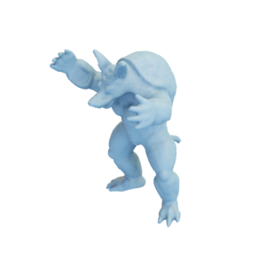

# Armadillo

A lower-resolution, remeshed version of the Stanford armadillo by [The Stanford 3D Scanning Repository](http://graphics.stanford.edu/data/3Dscanrep/).

The licensing requirements are described in detail in the [source's "Please acknowledge..."](http://graphics.stanford.edu/data/3Dscanrep/) section, and are copied here for reference:
_Please be sure to acknowledge the source of the data and models you take from this repository. In each of the listings below, we have cited the source of the range data and reconstructed models. You are welcome to use the data and models for research purposes. You are also welcome to mirror or redistribute them for free. Finally, you may publish images made using these models, or the images on this web site, in a scholarly article or book - as long as credit is given to the Stanford Computer Graphics Laboratory. However, such models or images are not to be used for commercial purposes, nor should they appear in a product for sale (with the exception of scholarly journals or books), without our permission._

You can cite this object in your work using this bibtex snippet:
    @misc{armadillo-mesh,
      title = {{Armadillo}},
      author = {{The Stanford 3D Scanning Repository}},
      note = {Downloaded modified version from odedstein-meshes \url{github.com/odedstein/meshes/tree/master/objects/armadillo}. Original mesh by V. Krishnamurthy and M. Levoy "Fitting Smooth Surfaces to Dense Polygon Meshes" (SIGGRAPH 1996)},
      year = {2023}
    }

