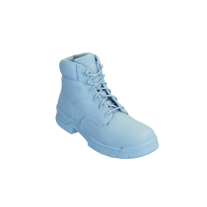

# Boot

Mesh of a boot.
Original mesh by [inciprocal via Sketchfab](https://sketchfab.com/3d-models/harrison-work-boot-d9506d9a318e4c56ac3d8ab273bd2540).



The original mesh was released under the [Creative Commons Attribution 4.0 International (CC BY 4.0) license](https://creativecommons.org/licenses/by/4.0/).
The modified mesh is hereby also released under the [Creative Commons Attribution 4.0 International (CC BY 4.0) license](https://creativecommons.org/licenses/by/4.0/), with appropriate attribution to the original contributor.

You can cite this object in your work using this bibtex snippet:
```
@misc{boot-mesh,
  title = {{Boot}},
  author = {inciprocal},
  note = {Downloaded modified version from odedstein-meshes \url{github.com/odedstein/meshes/tree/master/objects/boot}, originally from \url{sketchfab.com/3d-models/harrison-work-boot-d9506d9a318e4c56ac3d8ab273bd2540}. Asset licensed under CC BY 4.0.},
  year = {2023}
}
```
