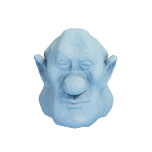

# Brucewick

Mesh of a head created by [Josh Holinaty](https://holinaty.com/).



Licensed under the [Attribution-NonCommercial 4.0 International (CC BY-NC 4.0)](https://creativecommons.org/licenses/by-nc/4.0/) License.

You can cite this object in your work using this bibtex snippet:
```
@misc{brucewick-mesh,
  title = {{Brucewick}},
  author = {Holinaty, Josh},
  note = {Downloaded from odedstein-meshes \url{github.com/odedstein/meshes/tree/master/objects/brucewick}. Asset licensed under CC BY-NC 4.0.},
  year = {2023}
}
```
