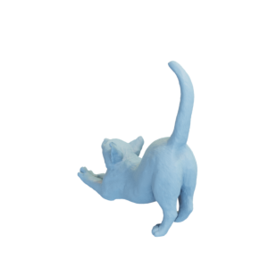

# Cat

Mesh of a cat, as well as a remeshed lower-resolution version.
Original mesh by [billyd via Thingiverse](https://www.thingiverse.com/thing:1565405).

High-res version:

Low-res version:

The original mesh was released under the [Creative Commons Attribution 4.0 International (CC BY 4.0) license](https://creativecommons.org/licenses/by/4.0/).
The remeshed version is hereby also released under the [Creative Commons Attribution 4.0 International (CC BY 4.0) license](https://creativecommons.org/licenses/by/4.0/), with appropriate attribution to the original contributor.

You can cite this object in your work using this bibtex snippet:
    @misc{cat-mesh,
      title = {{Cat}},
      author = {billyd},
      note = {Downloaded modified version from odedstein-meshes \url{github.com/odedstein/meshes/tree/master/objects/cat}, originally from \url{thingiverse.com/thing:1565405}. Asset licensed under CC BY 4.0.},
      year = {2023}
    }
