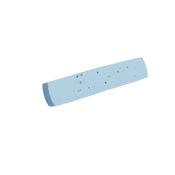

# Cheese

Mesh of a cheese with UV map, together with its texture.
Original by [3dvs_ch via Sketchfab](https://sketchfab.com/3d-models/raclette-1bd5e0599b3b4fb9b7cb1fe778ab027d).



This asset was originaly released under the [Creative Commons Attribution 4.0 International (CC BY 4.0 Deed) license](https://creativecommons.org/licenses/by/4.0/).

You can cite this object in your work using this bibtex snippet:
```
@misc{goathead-mesh,
  title = {{cheese}},
  author = {3dvs_ch},
  note = {Downloaded modified version from odedstein-meshes \url{github.com/odedstein/meshes/tree/master/objects/cheese}, originally from \url{sketchfab.com/3d-models/raclette-1bd5e0599b3b4fb9b7cb1fe778ab027d}. Asset licensed under CC BY 4.0 Deed.},
  year = {2021}
}
```
