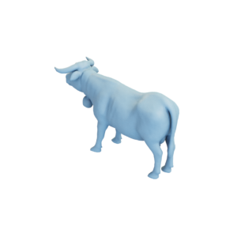

# Cow

Mesh of a cow, as well as a remeshed lower-resolution version.
Original mesh by [3dcs_ch via Thingiverse](https://www.thingiverse.com/thing:2431906).

High-res version:

Low-res version:

The original mesh was released under the [Creative Commons Attribution-NonCommercial 4.0 International (CC BY-NC 4.0) license](https://creativecommons.org/licenses/by-nc/4.0/).
The remeshed version is hereby also released under the [Creative Commons Attribution-NonCommercial 4.0 International (CC BY-NC 4.0) license](https://creativecommons.org/licenses/by-nc/4.0/), with appropriate attribution to the original contributor.

You can cite this object in your work using this bibtex snippet:
    @misc{cow-mesh,
      title = {{Cow}},
      author = {3dcs_ch},
      note = {Downloaded modified version from odedstein-meshes \url{github.com/odedstein/meshes/tree/master/objects/cow}, originally from \url{thingiverse.com/thing:2431906}. Asset licensed under CC BY 4.0.},
      year = {2023}
    }
