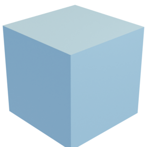

# Cube

Simple mesh of a cube, with and without bottom.

Cube:

Cube without bottom:

The mesh is hereby released under the [Creative Commons Attribution 4.0 International (CC BY 4.0) license](https://creativecommons.org/licenses/by/4.0/).

You can cite this object in your work using this bibtex snippet:
    @misc{cube-mesh,
      title = {{Cube}},
      author = {Stein, Oded},
      note = {Downloaded from odedstein-meshes \url{github.com/odedstein/meshes/tree/master/objects/cube}. Asset licensed under CC BY 4.0.},
      year = {2022}
    }
