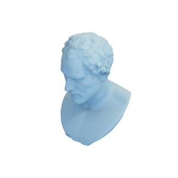

# Demosthenes

3D model of a bust of demosthenes, as well as a remeshed low-resolution version.

High-res version:

Low-res version:

This model was created by [ryanfb](https://sketchfab.com/ryanfb) and is
licensed under the [Creative Commons Attibution 4.0 International (CC BY 4.0)](https://creativecommons.org/licenses/by/4.0/) license.
It was originally uploaded to [sketchfab](https://sketchfab.com/3d-models/louvre-demosthenes-photoscan-cf5d9dd9bf4a457c95dc76e17848727b).

You can cite this object in your work using this bibtex snippet:
    @misc{demosthenes-mesh,
      title = {{Demosthenes}},
      author = {ryanfb},
      note = {Downloaded modified version from odedstein-meshes \url{github.com/odedstein/meshes/tree/master/objects/demosthenes}, originally from \url{sketchfab.com/3d-models/louvre-demosthenes-photoscan-cf5d9dd9bf4a457c95dc76e17848727b}. Asset licensed under CC BY 4.0.},
      year = {2021}
    }
