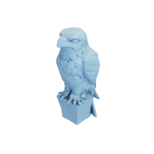

# Falcon statue

Mesh of a falcon statue, modified, and a version with boundaries at the bottom.
Original mesh by [colinfizgig via Thingiverse](https://www.thingiverse.com/thing:46631).

Closed surface:


With boundary:


The original mesh was released under the [Attribution-NonCommercial-ShareAlike 4.0 International (CC BY-NC-SA 4.0) license](https://creativecommons.org/licenses/by-nc-sa/4.0/).
The remeshed version is hereby also released under the [Attribution-NonCommercial-ShareAlike 4.0 International (CC BY-NC-SA 4.0) license](https://creativecommons.org/licenses/by-nc-sa/4.0/), with appropriate attribution to the original contributor.

You can cite this object in your work using this bibtex snippet:
```
@misc{falconstatue-mesh,
  title = {{Falcon statue}},
  author = {colinfizgig},
  note = {Downloaded modified version from odedstein-meshes \url{github.com/odedstein/meshes/tree/master/objects/falconstatue}, originally from \url{thingiverse.com/thing:46631}. Asset licensed under CC BY-NC-SA 4.0.},
  year = {2021}
}
```
