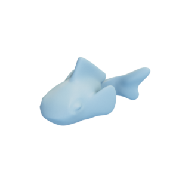
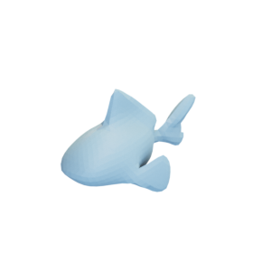
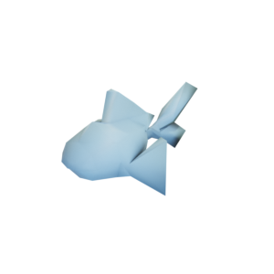

# Fish

The quad control mesh and textures, as well as triangle meshes with two different resolutions of Blub the fish by [Keenan Crane](https://www.cs.cmu.edu/~kmcrane/Projects/ModelRepository/).

Fish:

Low-resolution fish:

Fish control mesh:

The original quad mesh was released into the public domain by its creator.
The remeshed versions are hereby also released into the public domain.

