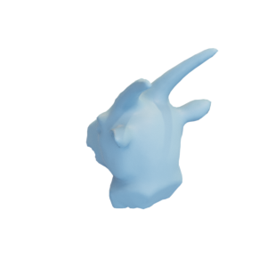

# Goat head

Mesh of a goat heat, remeshed from a mesh by by [hugoelec via Thingiverse](https://www.thingiverse.com/thing:42256).



The mesh is hereby released under the [Creative Commons Attribution 3.0 Unported (CC BY 3.0) license](https://creativecommons.org/licenses/by/3.0/), with appropriate attribution to the original contributor.

You can cite this object in your work using this bibtex snippet:
```
@misc{goathead-mesh,
  title = {{Goat head}},
  author = {hugoelec},
  note = {Downloaded modified version from odedstein-meshes \url{github.com/odedstein/meshes/tree/master/objects/goathead}, originally from \url{thingiverse.com/thing:42256}. Asset licensed under CC BY 3.0.},
  year = {2019}
}
```
