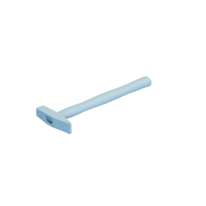

# Hammer

Mesh of a hammer.
Original mesh by [Andrea Spognetta (Spogna) via Sketchfab](https://sketchfab.com/3d-models/hammer-rawscan-01e5b5acad9843818529d15663df5b9e).

The original mesh was released under the [Creative Commons Attribution 4.0 International (CC BY 4.0) license](https://creativecommons.org/licenses/by/4.0/).
The modified mesh is hereby also released under the [Creative Commons Attribution 4.0 International (CC BY 4.0) license](https://creativecommons.org/licenses/by/4.0/), with appropriate attribution to the original contributor.

You can cite this object in your work using this bibtex snippet:
    @misc{hammer-mesh,
      title = {{Hammer}},
      author = {Spognetta, Andrea},
      note = {Downloaded modified version from odedstein-meshes \url{github.com/odedstein/meshes/tree/master/objects/hammer}, originally from \url{sketchfab.com/3d-models/hammer-rawscan-01e5b5acad9843818529d15663df5b9e}. Asset licensed under CC BY 4.0.},
      year = {2023}
    }
