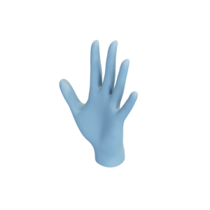
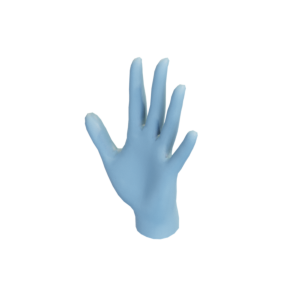
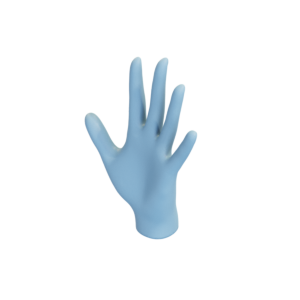

# Hand

Mesh of a hand in two resolutions, adapted from the mesh of a woman by [Max Planck Society e.V via SMPL](https://smpl.is.tue.mpg.de/bodylicense).

Hand:


Low-resolution hand:


Hand without boundaries:


The original mesh is released under the [Creative Commons Attribution 4.0 International (CC BY 4.0) license](https://creativecommons.org/licenses/by/4.0/)
The modified version is hereby released under the [Creative Commons Attribution 4.0 International (CC BY 4.0) license](https://creativecommons.org/licenses/by/4.0/), with appropriate attribution to the original contributor.

You can cite this object in your work using this bibtex snippet:
```
@misc{hand-mesh,
  title = {{Hand}},
  author = {{Max Planck Society e.V via SMPL}},
  note = {Downloaded modified version from odedstein-meshes \url{github.com/odedstein/meshes/tree/master/objects/hand}, adapted from M. Loper, N. Mahmood, J. Romero, G. Pons-Moll, M. Black "SMPL" (SIGGRAPH Asia 2015). Asset licensed under CC BY 4.0.},
  year = {2021}
}
```
