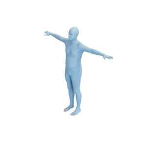
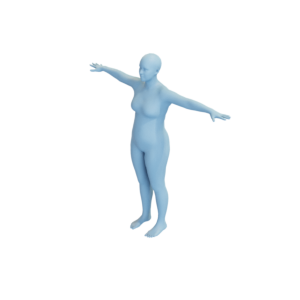
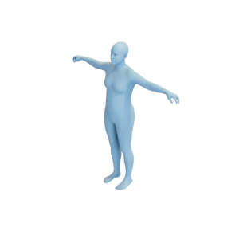

# Human

Mesh of a man and a woman by [Max Planck Society e.V via SMPL](https://smpl.is.tue.mpg.de/bodylicense). Mesh of gender-neutral human by [Max Planck Society e.V via SMPL-X](https://smpl-x.is.tue.mpg.de/bodylicense.html).

Man:


Woman:


Gender-neutral:


The meshes are released under the [Creative Commons Attribution 4.0 International (CC BY 4.0) license](https://creativecommons.org/licenses/by/4.0/).

You can cite this object in your work using this bibtex snippet:
```
@misc{human-mesh,
  title = {{Human}},
  author = {{Max Planck Society e.V via SMPL and SMPL-X}},
  note = {Downloaded modified version from odedstein-meshes \url{github.com/odedstein/meshes/tree/master/objects/human}, adapted from M. Loper, N. Mahmood, J. Romero, G. Pons-Moll, M. Black "SMPL" (SIGGRAPH Asia 2015) and G. Pavlakos, V. Choutas, N. Ghorbani, T. Bolkart, A. Osman, D. Tzionas, M. Black "SMPL-X" (CVPR 2019). Asset licensed under CC BY 4.0.},
  year = {2023}
}
```
