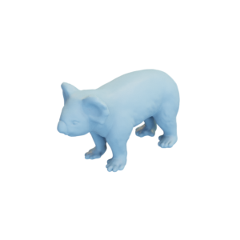

# Koala

Mesh of a koala, as well as a remeshed lower-resolution version.
Original mesh by [YahooJAPAN via Thingiverse](https://www.thingiverse.com/thing:182225).

Koala:

Low-resolution koala:

The original mesh was released under the [Creative Commons Attribution 3.0 Unported (CC BY 3.0) license](https://creativecommons.org/licenses/by/3.0/).
The remeshed version is hereby also released under the [Creative Commons Attribution 3.0 Unported (CC BY 3.0) license](https://creativecommons.org/licenses/by/3.0/), with appropriate attribution to the original contributor.

You can cite this object in your work using this bibtex snippet:
    @misc{koala-mesh,
      title = {{Koala}},
      author = {YahooJAPAN},
      note = {Downloaded modified version from odedstein-meshes \url{github.com/odedstein/meshes/tree/master/objects/koala}, originally from \url{thingiverse.com/thing:182225}. Asset licensed under CC BY 3.0.},
      year = {2019}
    }

