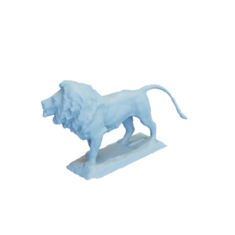

# Lion statue

Mesh of a lion statue.
This is a modified version of a mesh by by [tomburtonwood via Thingiverse](https://www.thingiverse.com/thing:25832).

The original mesh was released under the [Creative Commons Attribution-ShareAlike 3.0 Unported (CC BY-SA 3.0) license](https://creativecommons.org/licenses/by-sa/3.0/).
The modifications are also released under the [Creative Commons Attribution-ShareAlike 3.0 Unported (CC BY-SA 3.0) license](https://creativecommons.org/licenses/by-sa/3.0/), with appropriate attribution to the original contributor.

You can cite this object in your work using this bibtex snippet:
    @misc{lionstatue-mesh,
      title = {{Lion statue}},
      author = {tomburtonwood},
      note = {Downloaded modified version from odedstein-meshes \url{github.com/odedstein/meshes/tree/master/objects/lionstatue}, originally from \url{thingiverse.com/thing:25832}. Asset licensed under CC BY 3.0.},
      year = {2021}
    }
