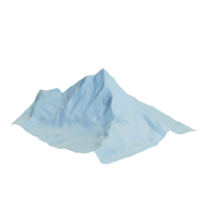

# Mountain

Mesh of a mountain, modified.
Original mesh by [lastloginname via Thingiverse](https://www.thingiverse.com/thing:991578).

The original mesh was released under the [Creative Commons Attribution 4.0 International (CC BY 4.0) license](https://creativecommons.org/licenses/by/4.0/).
The remeshed version is hereby also released under the [Creative Commons Attribution 4.0 International (CC BY 4.0) license](https://creativecommons.org/licenses/by/4.0/), with appropriate attribution to the original contributor.

You can cite this object in your work using this bibtex snippet:
    @misc{mountain-mesh,
      title = {{Mountain}},
      author = {lastloginname},
      note = {Downloaded modified version from odedstein-meshes \url{github.com/odedstein/meshes/tree/master/objects/mountain}, originally from \url{thingiverse.com/thing:991578}. Asset licensed under CC BY 4.0.},
      year = {2020}
    }
