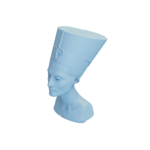

# Nefertiti

3D model of the bust of Nefertiti in the Egyptian museum of Berlin, and a lower-resolution version of it.

Nefertiti:

Low-resolution koala:

This model [was scanned by Nora Al-Badri and Jan Nikolai Nelles in 2016 and released into the public domain](https://hyperallergic.com/274635/artists-covertly-scan-bust-of-nefertiti-and-release-the-data-for-free-online/).
The modified version is also released into the public domain.

You can cite this object in your work using this bibtex snippet:
    @misc{nefertiti-mesh,
      title = {{Nefertiti}},
      author = {Al-Badri, Nora and Nelles, Jan Nikolai},
      note = {Downloaded modified version from odedstein-meshes \url{github.com/odedstein/meshes/tree/master/objects/nefertiti}.},
      year = {2023}
    }
