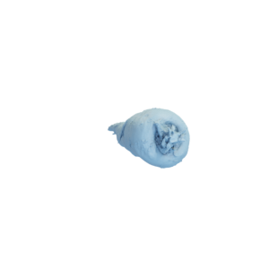

# Parsnip

Mesh of a parsnip.
Original mesh by [Bart via Sketchfab](https://sketchfab.com/3d-models/parsnip-9270b2c72df04b37bb6d3b6becec67ac).

The original mesh was released under the [Creative Commons Attribution 4.0 International (CC BY 4.0) license](https://creativecommons.org/licenses/by/4.0/).
The modified mesh is hereby also released under the [Creative Commons Attribution 4.0 International (CC BY 4.0) license](https://creativecommons.org/licenses/by/4.0/), with appropriate attribution to the original contributor.

You can cite this object in your work using this bibtex snippet:
    @misc{parsnim-mesh,
      title = {{Parsnip}},
      author = {Bart},
      note = {Downloaded modified version from odedstein-meshes \url{github.com/odedstein/meshes/tree/master/objects/parsnip}, originally from \url{sketchfab.com/3d-models/parsnip-9270b2c72df04b37bb6d3b6becec67ac}. Asset licensed under CC BY 4.0.},
      year = {2023}
    }
