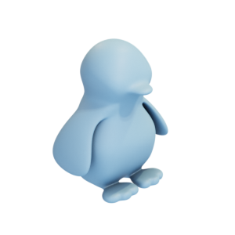

# Penguin

Control mesh and high-resolution mesh of a penguin.

Penguin:

Penguin control mesh:

The mesh is hereby released under the [Creative Commons Attribution 4.0 International (CC BY 4.0) license](https://creativecommons.org/licenses/by/4.0/).

You can cite this object in your work using this bibtex snippet:
    @misc{penguin-mesh,
      title = {{Penguin}},
      author = {Stein, Oded},
      note = {Downloaded from odedstein-meshes \url{github.com/odedstein/meshes/tree/master/objects/pengiun}. Asset licensed under CC BY 4.0.},
      year = {2023}
    }
