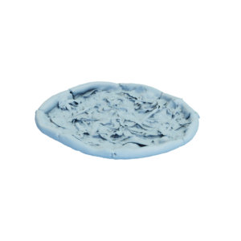

# Pizza

3D model of a pizza, together with a UV map and diffuse/glossy/normal textures



This model was created by [Rigsters](https://sketchfab.com/rigsters) and is
licensed under the [Creative Commons Attibution 4.0 International (CC BY 4.0)](https://creativecommons.org/licenses/by/4.0/) license.
It was originally uploaded to [sketchfab](https://sketchfab.com/3d-models/pizza-40d50989fec1460f8838b608d999ccd0).

You can cite this object in your work using this bibtex snippet:
```
@misc{pizza-mesh,
  title = {{Pizza}},
  author = {Rigsters},
  note = {Downloaded modified version from odedstein-meshes \url{github.com/odedstein/meshes/tree/master/objects/pizza}, originally from \url{sketchfab.com/3d-models/pizza-40d50989fec1460f8838b608d999ccd0}. Asset licensed under CC BY 4.0.},
  year = {2023}
}
```
