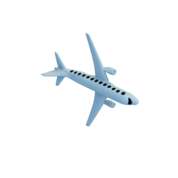

# Plane

Mesh of an airplane, as well as a remeshed version with exaggerated windows that are cut out of the mesh.
Original mesh by [YahooJAPAN via Thingiverse](https://www.thingiverse.com/thing:182252).

Plane:


Plane with holes:


The original mesh was released under the [Creative Commons Attribution 3.0 Unported (CC BY 3.0) license](https://creativecommons.org/licenses/by/3.0/).
The remeshed version is hereby also released under the [Creative Commons Attribution 3.0 Unported (CC BY 3.0) license](https://creativecommons.org/licenses/by/3.0/), with appropriate attribution to the original contributor.

You can cite this object in your work using this bibtex snippet:
```
@misc{plane-mesh,
  title = {{Plane}},
  author = {YahooJAPAN},
  note = {Downloaded modified version from odedstein-meshes \url{github.com/odedstein/meshes/tree/master/objects/plane}, originally from \url{thingiverse.com/thing:182252}. Asset licensed under CC BY 3.0.},
  year = {2019}
}
```
