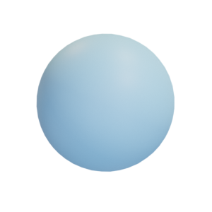

# Sphere

Mesh of a sphere created by Oded Stein.

The mesh is hereby released under the [Creative Commons Attribution 4.0 International (CC BY 4.0) license](https://creativecommons.org/licenses/by/4.0/).

You can cite this object in your work using this bibtex snippet:
    @misc{sphere-mesh,
      title = {{Sphere}},
      author = {Stein, Oded},
      note = {Downloaded from odedstein-meshes \url{github.com/odedstein/meshes/tree/master/objects/sphere}. Asset licensed under CC BY 4.0.},
      year = {2020}
    }
