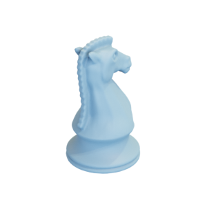

# Springer

Mesh of a springer chess piece.
Original mesh by [TimEdwards via thingiverse](https://www.thingiverse.com/thing:335658).



The original mesh was released under the [GNU General Public License v2.0](https://www.gnu.org/licenses/old-licenses/gpl-2.0.html).
The modified mesh is hereby also released under the [GNU General Public License v2.0](https://www.gnu.org/licenses/old-licenses/gpl-2.0.html).

You can cite this object in your work using this bibtex snippet:
```
@misc{springer-mesh,
  title = {{Springer}},
  author = {TimEdwards},
  note = {Downloaded modified version from odedstein-meshes \url{github.com/odedstein/meshes/tree/master/objects/springer}, originally from \url{thingiverse.com/thing:335658}. Asset licensed under GPLv2},
  year = {2023}
}
```
