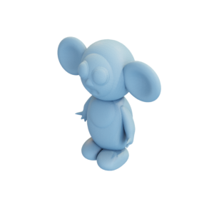

# Stuffed Toy

Mesh of a stuffed toy, made to resemble the stop-motion film character of Cheburashka.
Original mesh by Ilya Baran and Cosmic blobs, as described by [libigl](https://github.com/libigl/libigl-tutorial-data).

This mesh was published by the authors of libigl and follows its license, as described [here](https://libigl.github.io/LICENSE/). It is originally attributed to [Ilya Baran and Cosmic blobs](http://www.mit.edu/~ibaran/autorig/).

You can cite this object in your work using this bibtex snippet:
    @misc{stuffedtoy-mesh,
      title = {{Stuffed toy}},
      author = {Ilya Baran and Cosmic blobs},
      note = {Downloaded modified version from odedstein-meshes \url{github.com/odedstein/meshes/tree/master/objects/stuffedtoy}, originally from \url{mit.edu/~ibaran/autorig}.},
      year = {2020}
    }
