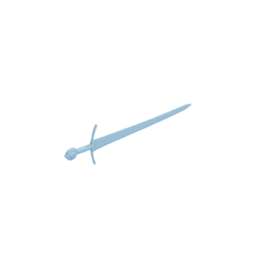

# Sword

Mesh of a sword, as a triangulated version and a quad-dominant version.
Original mesh by [The Oakeshott Institute via Sketchfab](https://sketchfab.com/3d-models/moonbrand-early-14th-c-arming-sword-80fa91fc8c974fd0acd2a55cc513edec).

Sword (triangulated, sword.obj):

Sword (quad-dominant, sword-quad-dominant.obj):

The original mesh was released under the [Creative Commons Attribution 4.0 International (CC BY 4.0) license](https://creativecommons.org/licenses/by/4.0/).
The modified mesh is hereby also released under the [Creative Commons Attribution 4.0 International (CC BY 4.0) license](https://creativecommons.org/licenses/by/4.0/), with appropriate attribution to the original contributor.

You can cite this object in your work using this bibtex snippet:
    @misc{sword-mesh,
      title = {{Sword}},
      author = {{The Oakeshott Institute}},
      note = {Downloaded modified version from odedstein-meshes \url{github.com/odedstein/meshes/tree/master/objects/sword}, originally from \url{sketchfab.com/3d-models/moonbrand-early-14th-c-arming-sword-80fa91fc8c974fd0acd2a55cc513edec}. Asset licensed under CC BY 4.0.},
      year = {2023}
    }
