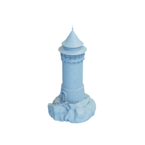
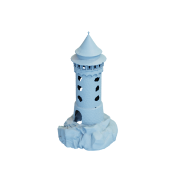

# Tower

Mesh of a Dragon Tower, as well as a remeshed version with exaggerated window and door holes that are cut out of the mesh.
Original mesh by [jansentee3d via Thingiverse](https://www.thingiverse.com/thing:3155868).

Tower:


Tower with holes:


The original mesh was released under the [Creative Commons Attribution-NonCommercial 3.0 Unported (CC BY-NC 3.0) license](https://creativecommons.org/licenses/by-nc/3.0/).
The remeshed version is hereby also released under the [Creative Commons Attribution-NonCommercial 3.0 Unported (CC BY-NC 3.0) license](https://creativecommons.org/licenses/by-nc/3.0/), with appropriate attribution to the original contributor.

You can cite this object in your work using this bibtex snippet:
```
@misc{tower-mesh,
  title = {{Tower}},
  author = {jansentee3d},
  note = {Downloaded modified version from odedstein-meshes \url{github.com/odedstein/meshes/tree/master/objects/tower}, originally from \url{thingiverse.com/thing:3155868}. Asset licensed under CC BY 3.0.},
  year = {2021}
}
```
