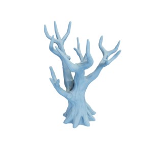

# Tree

Mesh of a tree.
Original mesh by [warmarine759 via Thingiverse](https://www.thingiverse.com/thing:3839198).

Tree (with boundary, the bottom of the tree is not meshed):


Tree, closed mesh:


The original mesh was released under the [Creative Commons ATTRIBUTION 4.0 INTERNATIONAL (CC BY 4.0) license](https://creativecommons.org/licenses/by/4.0/).
The modified mesh is hereby also released under the [Creative Commons ATTRIBUTION 4.0 INTERNATIONAL (CC BY 4.0) license](https://creativecommons.org/licenses/by/4.0/), with appropriate attribution to the original contributor.

You can cite this object in your work using this bibtex snippet:
```
@misc{tree-mesh,
  title = {{Tree}},
  author = {warmarine759},
  note = {Downloaded modified version from odedstein-meshes \url{github.com/odedstein/meshes/tree/master/objects/tree}, originally from \url{thingiverse.com/thing:3839198}. Asset licensed under CC BY 4.0.},
  year = {2024}
}
```
