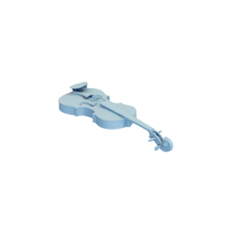

# Violin

Mesh of a violin, modified.
Original mesh by [Virtual Museums of Małopolska via Sketchfab](https://sketchfab.com/3d-models/violin-a784af0713a643b19ffcf65194bc0fbf).

The original mesh was released under the [CC0 1.0 Universal (CC0 1.0)
Public Domain Dedication](https://creativecommons.org/publicdomain/zero/1.0/).
The modified mesh is hereby also released under the [CC0 1.0 Universal (CC0 1.0)
Public Domain Dedication](https://creativecommons.org/publicdomain/zero/1.0/), with appropriate attribution to the original contributor.

You can cite this object in your work using this bibtex snippet:
    @misc{violin-mesh,
      title = {{Violin}},
      author = {{Virtual Museums of Ma\l{}opolska}},
      note = {Downloaded modified version from odedstein-meshes \url{github.com/odedstein/meshes/tree/master/objects/violin}, originally from \url{sketchfab.com/3d-models/violin-a784af0713a643b19ffcf65194bc0fbf}.},
      year = {2023}
    }
