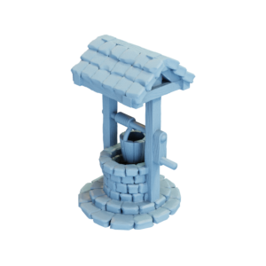

# Well

Mesh of a well.
Version both without and with boundary.
Original mesh by [onimoji via Thingiverse](https://www.thingiverse.com/thing:3587292).

Well (closed, no boundary)


Well (bottom removed, has boundary)


The original mesh was released under the [Creative Commons ATTRIBUTION-NONCOMMERCIAL 4.0 INTERNATIONAL (CC BY-NC 4.0) license](https://creativecommons.org/licenses/by-nc/4.0/).
The remeshed version is hereby also released under the [Creative Commons ATTRIBUTION-NONCOMMERCIAL 4.0 INTERNATIONAL (CC BY-NC 4.0) license](https://creativecommons.org/licenses/by-nc/4.0/), with appropriate attribution to the original contributor.

You can cite this object in your work using this bibtex snippet:
```
@misc{well,
  title = {{Well}},
  author = {onmioji},
  note = {Downloaded modified version from odedstein-meshes \url{github.com/odedstein/meshes/tree/master/objects/well}, originally from \url{thingiverse.com/thing:3587292}. Asset licensed under CC BY-NC 4.0.},
  year = {2019}
}
```
