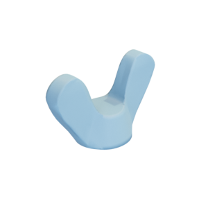

# Wing nut

Mesh of a wing nut created using the methods from the paper ["Developability of Triangle Meshes"](http://www.cs.columbia.edu/cg/developability/) by Oded Stein, Eitan Grinspun, and Keenan Crane.



The mesh is hereby released under the [Creative Commons Attribution 4.0 International (CC BY 4.0) license](https://creativecommons.org/licenses/by/4.0/).

You can cite this object in your work using this bibtex snippet:
```
@misc{wingnut-mesh,
  title = {{Wing nut}},
  author = {Stein, Oded and Grinspun, Eitan and Crane, Keenan},
  note = {Downloaded from odedstein-meshes \url{github.com/odedstein/meshes/tree/master/objects/wingnut}. Asset licensed under CC BY 4.0.},
  year = {2019}
}
```
